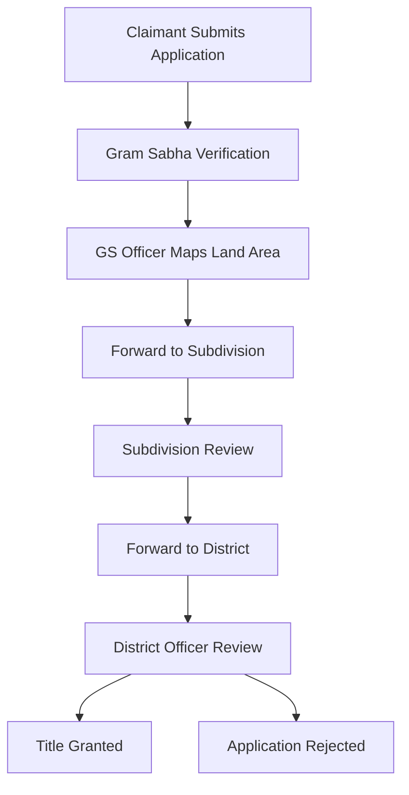

# FRA Digitalisation System - SIH 2024

A comprehensive digital platform for Forest Rights Act (FRA) claim management and processing, developed for Smart India Hackathon 2024.

## 🌟 Project Overview

This system digitizes the entire Forest Rights Act claim process, providing a seamless workflow from claim submission to title grant approval across multiple administrative levels.

## 🎯 Key Features

### Multi-Role Dashboard System
- **👥 Claimants**: Submit IFR/CFR applications with document uploads
- **🏛️ Gram Sabha Officers**: Verify claims, map land areas using GIS
- **📋 Subdivision Officers**: Review and approve/reject claims
- **🏢 District Officers**: Final approval and title grant processing

### 🗺️ Interactive GIS Mapping
- **Mapbox Integration**: Satellite imagery with polygon drawing
- **Land Area Calculation**: Precise area measurements using Turf.js
- **Multi-layer Support**: Different land types (claimed, forest, pond, government)
- **Cross-role Visibility**: Maps drawn by GS officers visible to all subsequent reviewers

### 📊 Real-time Status Tracking
- **Progressive Status Updates**: 5-stage claim tracking
- **Visual Progress Indicators**: Step-by-step completion status
- **Automated Notifications**: Status change alerts
- **Complete Audit Trail**: Full workflow history

### 🔐 Secure Authentication
- **Role-based Access Control**: Jurisdiction-specific data access
- **JWT Authentication**: Secure session management
- **HTTP-only Cookies**: Enhanced security for officer dashboards

## 🏗️ System Architecture

### Backend (Node.js + Express)
```
backend/
├── controller/          # API route handlers
├── model/              # MongoDB schemas
├── middlewares/        # Authentication & validation
├── routes/             # API endpoint definitions
├── scripts/            # Database utilities & tests
└── data/               # Geographic data (GP codes, villages)
```

### Frontend (React + Vite)
```
frontend/
├── src/
│   ├── components/     # Reusable UI components
│   ├── pages/          # Dashboard pages by role
│   ├── communityUserDashboard/  # Claimant interface
│   ├── gramSabhaDashboard/      # GS officer interface
│   ├── blockOfficer/            # Subdivision officer interface
│   └── districtOfficer/         # District officer interface
```

## 🚀 Getting Started

### Prerequisites
- Node.js (v16 or higher)
- MongoDB (local or Atlas)
- Git

### Installation

1. **Clone the repository**
   ```bash
   git clone https://github.com/Tvashtransh/SIh-Public.git
   cd SIh-Public
   ```

2. **Backend Setup**
   ```bash
   cd backend
   npm install
   
   # Create .env file
   echo "MONGO_URL=mongodb://localhost:27017/fra-digitalisation" > .env
   echo "JWT_SECRET=your-jwt-secret-key" >> .env
   
   # Start the server
   npm start
   ```

3. **Frontend Setup**
   ```bash
   cd ../frontend
   npm install
   
   # Start the development server
   npm run dev
   ```

4. **Access the Application**
   - Frontend: http://localhost:5173
   - Backend API: http://localhost:8000

## 👥 User Credentials

### Test Accounts

**Claimants (End Users)**
- Register through the application or use test accounts

**Gram Sabha Officers**
- Check `backend/credentials-phanda-gs.txt` for Phanda officers
- Check `backend/credentials-berasia-gs.txt` for Berasia officers

**Subdivision Officers**
- **Phanda**: PHN001 / phanda123
- **Berasia**: BRS001 / berasia123

**District Officer**
- **Bhopal**: BHO001 / bhopaldistrict123

## 🗺️ Geographic Coverage

### Madhya Pradesh - Bhopal District
- **Phanda Subdivision**: 47 Gram Panchayats
- **Berasia Subdivision**: 66 Gram Panchayats
- **Total Coverage**: 113+ villages with GS officers

## 📈 Workflow Process



## 🛠️ Technology Stack

### Backend
- **Runtime**: Node.js
- **Framework**: Express.js
- **Database**: MongoDB with Mongoose
- **Authentication**: JWT + bcrypt
- **Validation**: Express middleware

### Frontend
- **Framework**: React 18
- **Build Tool**: Vite
- **Styling**: Tailwind CSS
- **Mapping**: Mapbox GL JS
- **Animations**: Framer Motion
- **HTTP Client**: Fetch API

### GIS & Mapping
- **Map Provider**: Mapbox
- **Drawing Tools**: @mapbox/mapbox-gl-draw
- **Geometric Calculations**: @turf/turf
- **Coordinate System**: WGS84 (EPSG:4326)

## 🔧 Key Features Implemented

### ✅ Authentication & Authorization
- Multi-role login system
- Jurisdiction-based access control
- Secure password hashing
- Session management with cookies

### ✅ Claim Management
- IFR/CFR application submission
- Document upload and verification
- Status tracking and updates
- Workflow management

### ✅ GIS Integration
- Interactive map drawing
- Land area calculation
- Polygon visualization
- Cross-platform map viewing

### ✅ Dashboard Analytics
- Real-time statistics
- Claim status distribution
- Performance metrics
- Visual data representation

### ✅ Responsive Design
- Mobile-friendly interface
- Cross-browser compatibility
- Accessible UI components
- Progressive web app features

## 📱 Mobile Responsiveness

The application is fully responsive and optimized for:
- **Desktop**: Full dashboard experience
- **Tablet**: Touch-friendly interface
- **Mobile**: Optimized forms and navigation

## 🔒 Security Features

- **Data Encryption**: Sensitive data protection
- **Input Validation**: XSS and injection prevention
- **Access Control**: Role-based permissions
- **Audit Logging**: Complete action tracking

## 📊 Database Schema

### Key Collections
- **Users/Claimants**: Personal and authentication data
- **Claims**: FRA applications and workflow status
- **Admins**: Officers across all levels
- **Notifications**: System alerts and updates

## 🧪 Testing

The project includes comprehensive testing utilities:
- **API Testing**: Backend endpoint validation
- **Authentication Testing**: Login flow verification
- **Workflow Testing**: Complete claim processing
- **Data Integrity**: Database consistency checks

## 📈 Performance Optimizations

- **Lazy Loading**: Component-based code splitting
- **Image Optimization**: Mapbox tile caching
- **Database Indexing**: Optimized query performance
- **Bundle Optimization**: Vite build optimizations

## 🌐 Deployment Ready

The application is configured for:
- **Development**: Local environment setup
- **Staging**: Testing environment
- **Production**: Cloud deployment ready

## 🤝 Contributing

1. Fork the repository
2. Create a feature branch (`git checkout -b feature/AmazingFeature`)
3. Commit your changes (`git commit -m 'Add some AmazingFeature'`)
4. Push to the branch (`git push origin feature/AmazingFeature`)
5. Open a Pull Request

## 📄 License

This project is developed for Smart India Hackathon 2024 and is intended for educational and governmental use.

## 👥 Team

Developed by Team Tvashtransh for SIH 2024 - Problem Statement: Forest Rights Act Digital Platform

## 📞 Support

For technical support or questions:
- Create an issue in this repository
- Contact the development team

---

## 🎯 Smart India Hackathon 2024

This project addresses the digital transformation of Forest Rights Act processes, making them more transparent, efficient, and accessible to forest-dwelling communities across India.

**Problem Statement**: Digitalization of Forest Rights Act Claims Processing
**Category**: Software
**Theme**: Smart Governance & Public Service
